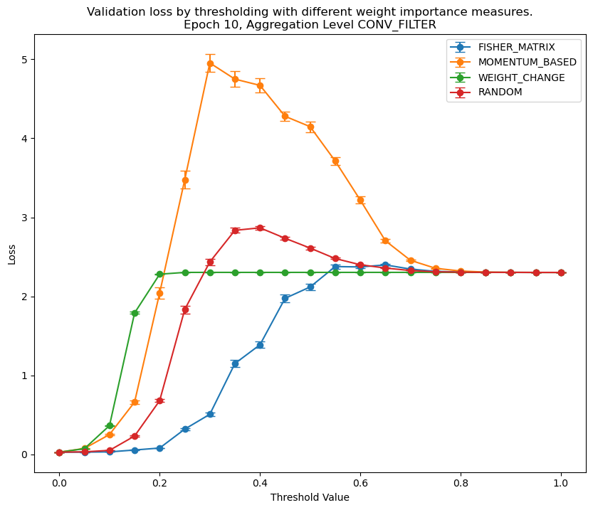

# Weight Importance Measure Orderings
## Author: Hayden McAlister

### Introduction and Explanation
In machine learning, a model (in this project, a neural network) attempts to fit data to best solve a task. For example, a neural network could be presented with many images of handwritten 0's and 1's, and attempt to classify new images as either 0 or 1. Sequential learning is to train a model on one task (e.g. classify 0's and 1's) then, without presenting the first tasks data again, attempt to learn a new task (e.g. classify 2's and 3's). This commonly results in a phenomenon known as catastrophic forgetting, where the model *can* learn the second task but in the process completely forgets the first; as if it was never trained on the first task at all.

There have been many attempts to solve catastrophic forgetting, ranging from introducing previous task data (or an approximation of it) known as pseudorehearsal (A Robins. Catastrophic forgetting, rehearsal and pseudorehearsal. Connection Science, 1995.) to additional terms in the loss function to preserve weights. One of the most promising methods in the latter attempt is elastic weight consolidation (J Kirkpatrick, et al. Overcoming catastrophic forgetting in neural networks. DeepMind, 2017.): where weights are preserved in proportion to how important they are to a given task. There have been many different weight importance measures with many different justifications but the weight importance measure has generally been determined on a task by task basis looking at loss performance. 

Finally getting to the point of this project, we seek a method to more rigorously justify which weight importance measures are useful, good at a task, and profile the performance. Importantly, we seek to order weight importance measures to more quantitatively state that method X is better than method Y (on a specific task, for a specific model architecture, etc...). We do this by training a model on a task for some number of epochs before testing the model on the validation dataset. We validate the model with every combination of weight importance measure, aggregation method (e.g. aggregate the weight importance measures of a convolutional filter to avoid throwing away parts of a filter), meaning there are many validations that need to take place! To test the different combinations, we threshold the model based on the weight importance measure: weights with an importance in the bottom specified percentile are replaced with a small random weight. Starting with a threshold value of 0 (where the model is unchanged from training) to 1 (where the model is effectively random) we can profile how well a given weight importance measure identifies weights important to a task. If we can threshold more weights without compromising validation loss we can assume that weight importance measure is good!

### Running the project
Note the experiments in this project effectively perform a grid search over several hyperparameters. For a neural network, this can take a long time! It is highly advised to have a jupyter server running on a machine that exposes a reasonably powerful graphics card for tensorflow to hook into. Even then, replicating these experiments can take several hours - consider running overnight.

`main.ipynb` is a notebook that selects a task (see the `Tasks` directory for options), creates a model for said task, and defines the bounds of the grid search. You can select different weight importance measures to test, as well as different aggregation levels. Be warned that each added aggregation method and weight importance measure will drastically increase the time to collect the data. You can also select the number of epochs to train before validating the weight importance measures, and the number threshold values to test at each validation.

This data is saved to a pandas dataframe and a CSV file after each validation step. This csv can be loaded by `Data Analysis.py` to nicely plot the various weight importance measures and aggregation methods against one another. Some data from previous trials is available in the `data` directory.

Some data is plotted and shown below:

Here we see in purple what happens if we threshold by randomly assigned weight importance measures. This can form a good baseline for understanding other measures. Starting for a relatively trained model (at 0 thresholding) we see validation loss quickly jump before converging to ~2.303 (given by `ln(10)`, which corresponds to randomly guessing at the 10 CIFAR10 data classes for categorical crossentropy). We can see the major uptick in loss occurs somewhere between 0.05 and 0.10 thresholding.

Looking at the Fisher Information Matrix method (presented in the original EWC paper) we see that the model has the same start and end losses (as expected) but can sustain much more thresholding before jumping in loss. This could indicate that perhaps the Fisher Information Matrix is a better method for assigning weight importance than random. Other epoch data and other trials can sometimes show the inverse of this relationship, so more work is needed.

### The future of this project
In future, it would be nice to add other weight importance measures from the literature, such as memory aware synapses or synaptic intelligence. It would also be nice to review the codebase for bugs - I believe that Unit aggregation may not be behaving as intended so beware using this!